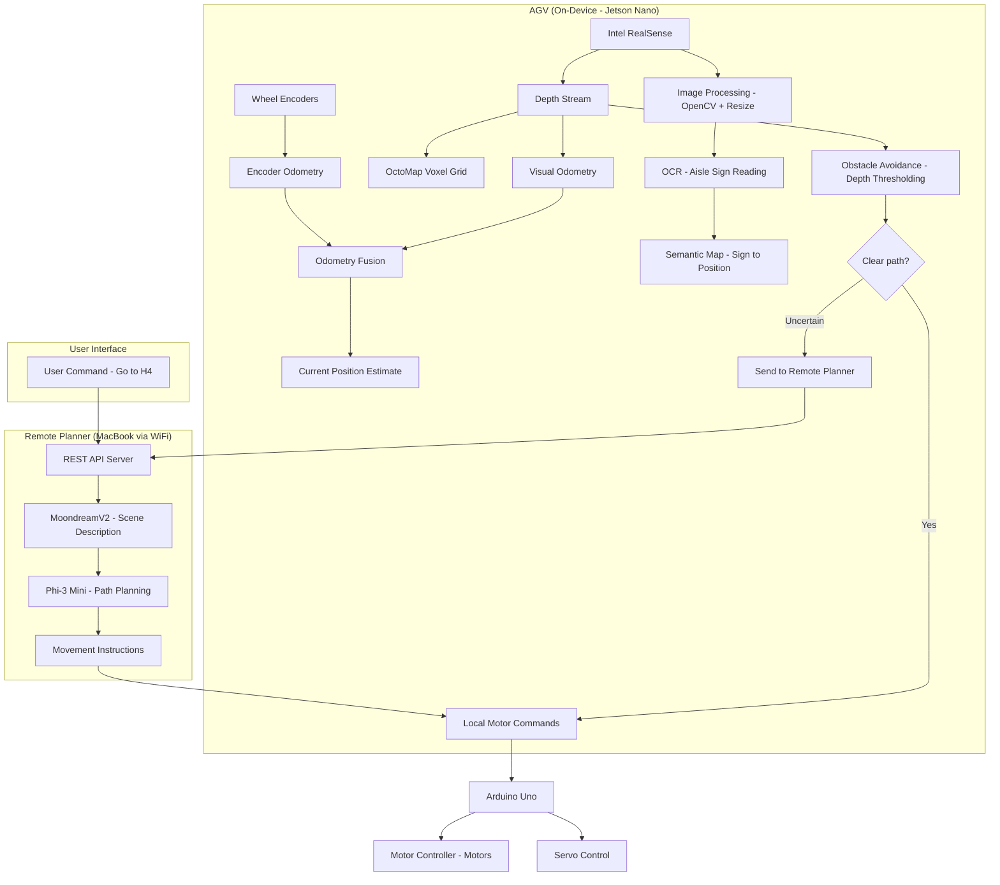

# Warehouse AGV — Vision-Language Autonomous Guided Vehicle

A small Automated Guided Vehicle (AGV) that navigates warehouse aisles using hybrid vision-language intelligence. The robot perceives its environment on-device (Jetson Nano), reads aisle signs for localization, avoids obstacles reactively, and uses a remote VLM+LLM pipeline for high-level path planning.

## Architecture



## Key Features

- **Zero-setup localization** — no pre-mapping required; builds spatial understanding by exploring and reading signs
- **Hybrid intelligence** — fast local obstacle avoidance + powerful remote LLM reasoning
- **Lightweight 3D mapping** — OctoMap voxel grid for minimal compute and storage
- **Semantic navigation** — understands aisle labels, reasons about warehouse layout
- **Natural language commands** — "Go to aisle H4"

## Hardware BOM (Bill of Materials)

| Component | Model | Purpose |
|-----------|-------|---------|
| Compute Board | NVIDIA Jetson Nano 4GB | Main on-device processing |
| Microcontroller | Arduino Uno | Motor control, encoder reading |
| Camera | Intel RealSense D435/D455 | RGB + Depth perception |
| Motor Controller | L298N or similar H-Bridge IC | DC motor driving |
| Motors | DC gear motors with encoders (x2) | Differential drive |
| Servo | SG90 or MG996R | Camera pan |
| Chassis | Small RC car chassis or custom | Physical platform |
| Power | 5V power bank (Jetson) + 7-12V battery (motors) | Power supply |
| WiFi | Built-in or USB WiFi adapter | Communication with remote planner |

## Software Stack

### On-Device (Jetson Nano)
- **OS:** JetPack 4.6 (Ubuntu 18.04 based)
- **Camera:** pyrealsense2
- **Computer Vision:** OpenCV 4.x
- **OCR:** EasyOCR or PaddleOCR
- **SLAM/Mapping:** OctoMap
- **Visual Odometry:** Custom (feature matching + depth)
- **Communication:** Python requests (HTTP client)
- **Serial:** pyserial (Jetson ↔ Arduino)

### Remote Planner (MacBook)
- **Model Runtime:** Ollama
- **VLM:** MoondreamV2 (1.8B params, ~1.8GB)
- **LLM:** Phi-3 Mini (3.8B params, ~2.3GB)
- **API Server:** FastAPI
- **Total RAM:** ~6GB

### Arduino
- **Firmware:** C++ (Arduino IDE or PlatformIO)
- **Protocol:** Serial JSON commands

## Project Structure

```
warehouse-agv/
├── README.md
├── docs/
│   ├── academic_report.md        # Full academic project report
│   ├── deployment_options.md     # Server (B) and Cloud (C) deployment guides
│   └── future_work.md           # Voice interaction, improvements
├── firmware/
│   └── arduino_motor_control/   # Arduino motor + encoder + servo firmware
│       └── arduino_motor_control.ino
├── jetson/
│   ├── main.py                  # Main AGV control loop
│   ├── camera.py                # RealSense capture and processing
│   ├── odometry.py              # Encoder + visual odometry fusion
│   ├── mapping.py               # OctoMap voxel grid management
│   ├── obstacle_avoidance.py    # Local reactive obstacle avoidance
│   ├── ocr_reader.py            # Aisle sign OCR
│   ├── semantic_map.py          # Sign → position mapping
│   ├── motor_controller.py      # Serial communication with Arduino
│   ├── remote_planner_client.py # HTTP client to remote planner
│   └── config.py                # Configuration constants
├── planner/
│   ├── server.py                # FastAPI REST API server
│   ├── vlm_service.py           # MoondreamV2 integration via Ollama
│   ├── llm_service.py           # Phi-3 Mini planning via Ollama
│   ├── prompts.py               # System prompts for the LLM planner
│   └── requirements.txt         # Python dependencies
└── tests/
    ├── test_obstacle_avoidance.py
    ├── test_semantic_map.py
    ├── test_planner_api.py
    └── test_odometry.py
```

## Quick Start

### 1. Remote Planner (MacBook)
```bash
# Install Ollama
brew install ollama

# Pull models
ollama pull moondream
ollama pull phi3:mini

# Start the planner server
cd planner/
pip install -r requirements.txt
python server.py
```

### 2. Jetson Nano
```bash
# Install dependencies
pip install pyrealsense2 opencv-python easyocr pyserial requests numpy

# Install OctoMap
sudo apt-get install liboctomap-dev python3-octomap

# Configure WiFi and planner IP
nano jetson/config.py  # Set PLANNER_URL

# Run
python jetson/main.py
```

### 3. Arduino
```bash
# Upload firmware via Arduino IDE or PlatformIO
# Connect: Jetson USB → Arduino USB Serial
```

## Usage

```bash
# On the Jetson Nano, after all systems are running:
python jetson/main.py

# The robot starts in exploration mode, reading signs and building its map.
# To issue a navigation command, use the remote planner API:
curl -X POST http://<macbook-ip>:8000/plan \
  -H "Content-Type: application/json" \
  -d '{"goal": "Go to aisle H4", "semantic_map": {...}, "current_position": [0, 0, 0]}'
```

## Deployment Options

See [docs/deployment_options.md](docs/deployment_options.md) for:
- **Option A:** MacBook on same WiFi (default, documented here)
- **Option B:** Dedicated always-on server
- **Option C:** Cloud API (Groq, Together.ai, etc.)

## Future Work

- Voice interaction with human obstacles ("go around me", "pass on my left")
- Multi-robot coordination
- Map persistence across sessions
- Integration with warehouse management systems (WMS)

## License

MIT
